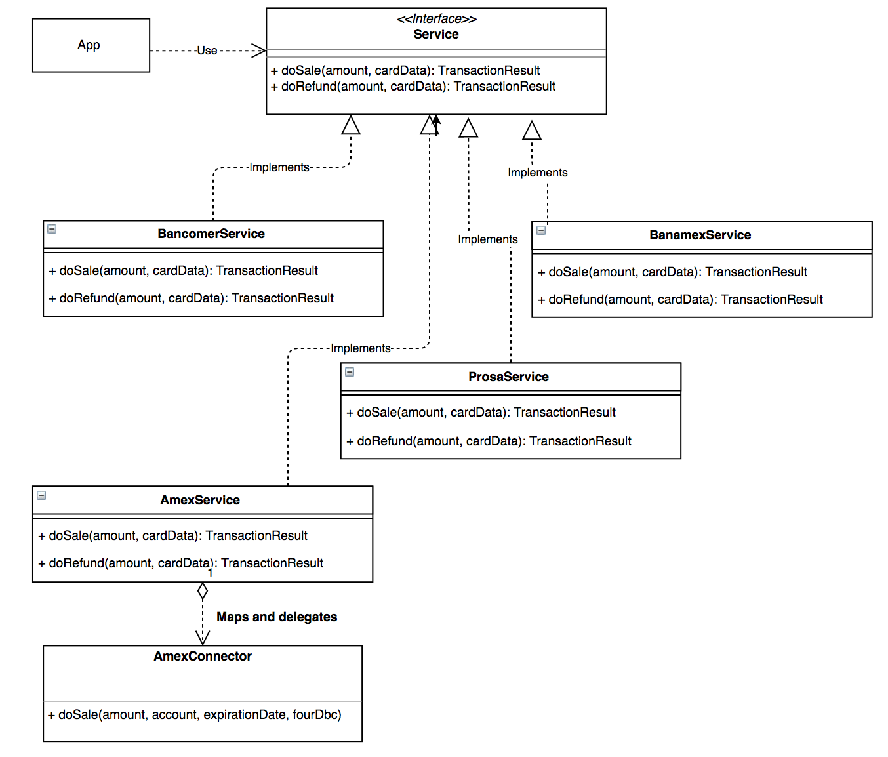

# Adapter Pattern (Structural)
>Allows classes with incompatible interfaces to work together by wrapping its own interface around that of an already existing class

## Problem 
- You have an old component implementing the required functionality for a new system, but its interface isn’t compatible with the new design.
- You have a system using a component to do something and you need to replace that component with a new one that offers new functionality. The interface in the new component isn’t compatible with the old system.

## Solution
Creates a class implementing the desired interface that maps and delegates the request to and from the legacy component

### Pros
- Reuse existent code even when it isn't compatible directly with the system which requires it.  

## Related design patterns
- Adapter is also called**Wrapper**
- While Adapter achieves the interaction between two existent and originally incompatible components,**Bridge**
  proposes a way to design future components to be compatible with the existent code decoupling interface 
  and implementation 
    
## Example

