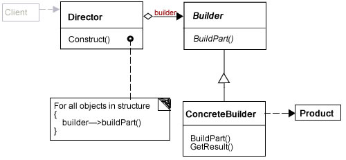

# Builder Pattern (Creational)
>Constructs complex objects by separating construction and representation

## Problem 
It is required to construct a complex output in one or many representations

## Solution
Separate the algorithm for interpreting the input from the algorithm for building and representing 
the resulting products.

Builder focuses on constructing complex objects step by step.

It is required to create a main class which directs the creation step by step of the output without 
focusing in the details of the output format implementation. The output writers should be interchangeable. 

## General structure

## Reference

https://sourcemaking.com/design_patterns/builder
http://www.php5dp.com/php-builder-design-pattern-part-i-one-process-many-representations/
