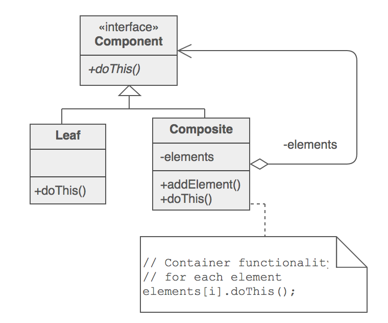

# Composite (structural)
>Composes zero-or-more similar objects so that they can be manipulated as one object

## Problem 
You have containers where containees can be also containers, both are handled differently but
 querying the type is not desirable. 

###Examples
 - Directories
 - Menus
 - Widgets
 - Arithmetic expressions

## Solution

1. Create an interface that makes your containers and containees interchangeable. 
2. All containers and containees declares an "is-a" relationship to that interface
3. All containers declare a one to many "has a" relationship to the interface

###Notes

- Composite is intended to manage an object without being aware of what other many objects
are inside
- There is a discussion about transparency vs safety regarding the methods located in the common interface.
(Locate meaningless operations for leaf components in order to be able to send same messages to all components
without ask the type) 

## General structure

## Reference

- https://sourcemaking.com/design_patterns/composite
