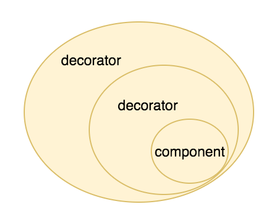
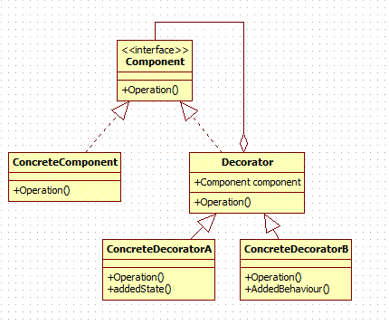

# Decorator Pattern (Structural)

> The Decorator Pattern attaches additional responsibilities to an object dynamically. 
Decorators provide a flexible alternative to subclassing for extending functionality.

---
## Problem

Need to add behavior to individual objects at run time

---
## Solution

- Decorator pattern can be used to decorate (extend) the functionality

---
## Characteristics

- Think in decorator as a wrapper 
- You can use one or more decorators to wrap an object

- Decorators contain a reference to the actual objects
- Decorators have the same supertype as the objects they decorate
- We can pass around a decorated object in place of the actual object
- Decorators receive all requests from a client, and then it forwards these calls to the actual object
- `KEY POINT: Decorators add their own behavior either before and/or after delegating to the object their
decorate to do the rest of the job` 

---
## Actors

- Component: Defines the interface for objects that can have responsibilities added to them dynamically
- ConcreteComponent (Wrapped): Defines an object to which additional responsibilities can be attached
- Decorator (Wrapper): Maintains a reference to a Component object and implements the interface that conforms to Component's interface
- ConcreteDecorator: Adds responsibilities to the component

---
## Applicability

Use Decorator pattern:

- To add responsibilities to individual objects dynamically and transparently
- For responsibilities that can be removed
- When subclassing is impractical

---
## Benefits

- Add responsibilities at run time 
- Open closed principle
- Decorator prevents the proliferation of subclasses leading to less complexity and confusion

---
## Issues

- Sometimes add a lot of small classes
- Introducing decorators can increase the complexity of the code needed to instantiate the component