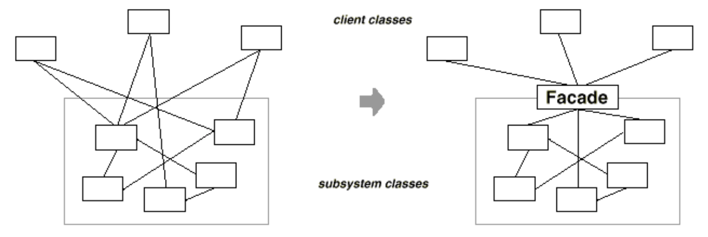
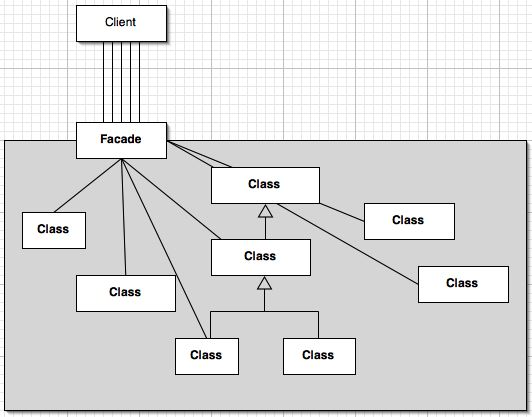

# Facade Pattern (Structural)

>  The Facade Pattern provides a unified interface to a set of interfaces in a subsystem. 
Facade defines a higher level interface that makes the subsystem easier to use

---
## Problem
Systems need to call functions from sub-systems what makes it complex when the dependencies are too 
many

---
## Solution
A common design goal is to minimize the communication and dependencies between subsystems making it 
easier. One way to achieve this goal is to introduce a facade object that provides a single, 
simplified interface to the more general facilities of a subsystem

---
## Characteristics
- Hides all the complexity of one or more classes behind
- Make an interface simpler
- Facade wraps to provide a simplified interface
- The pattern allows for any number of facades to be created for a given subsystem

---
## Actors

- Facade: 
  - Knows which subsystem classes are responsible for a request 
  - Delegates client requests to appropriate subsystem objects
- Subsystem classes: 
  - implement subsystem functionality
  - Handle work assigned by the Facade object
  - Have no knowledge of the facade

---
### Applicability

Use the Facade pattern when:

- You want to provide a simple interface to a complex subsystem
- There are many dependencies between clients and the implementation classes of an abstraction
- You want to layer your subsystems

---
## Benefits
- Decouple your client implementation from any one subsystem
- Law of Demeter
- It doesn't prevent applications from using subsystem classes if they need to

