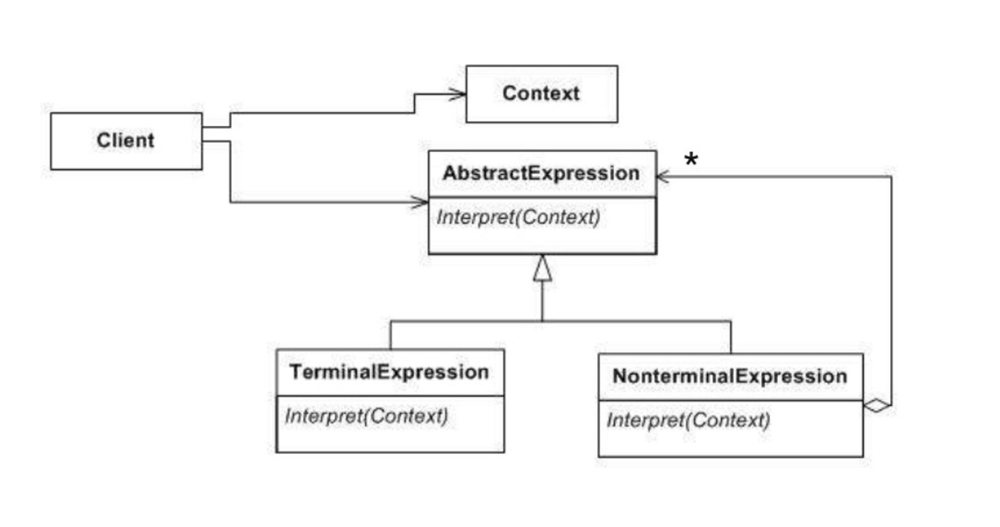
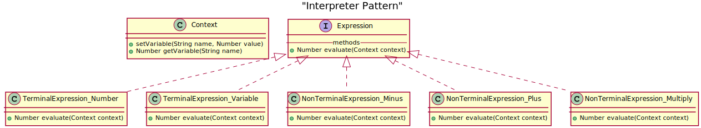

# Interpreter (Behavioral)
>Implements a specialized language.

## Problem
Interpret a language 

## Solution
Interpreter suggests modeling the domain with a tree of classes where each rule in the grammar is 
either a 'composite' (a rule that references other rules) or a terminal (a leaf node in a tree structure). 

An abstract base class specifies the method interpret(). Each concrete subclass implements  interpret() 
by accepting (as an argument) the current state of the language stream, and adding its contribution 
to the problem solving process.

## General structure


## Actors

- Abstract expression. 
    - Declares a interface for executing an operation
- Terminal expression. 
    - Implements an interpret operation associated with terminal symbols in grammar
    - Interprets expressions containing any of the terminal tokens in the grammar
- Non-terminal expression.
    - Interprets all non-terminal expressions in the grammar
- Context
    - Contains the global information that is part of the parse
- Client
    - Builds the sintax tree from the preceding expression types and invokes the interpret operation
      
## Considerations

- This pattern is not a Parser. It specifically does not address the issue of parsing the input

## Pros

- Easier to change and extend the grammar
- Complex for big grammars 

##Example


... or generate it with [plantext](https://www.planttext.com/) :

@startuml

title "Interpreter Pattern"

class Context  {
    +setVariable(String name, Number value)
    +getVariable(String name) : Number
}

interface  {
 -- methods --
 +Number evaluate(Context context)
}

class TerminalExpression_Number implements Expression {
    +Number evaluate(Context context)
}

class TerminalExpression_Variable implements Expression {
    +Number evaluate(Context context)
}

class NonTerminalExpression_Minus implements Expression {
    +Number evaluate(Context context)
}

class NonTerminalExpression_Plus implements Expression {
    +Number evaluate(Context context)
}

class NonTerminalExpression_Multiply implements Expression {
    +Number evaluate(Context context)
}

@enduml
```


## References

https://es.slideshare.net/amanicka/interpreter-pattern-final1

https://sourcemaking.com/design_patterns/interpreter

https://es.wikipedia.org/wiki/Interpreter_(patr%C3%B3n_de_dise%C3%B1o)

