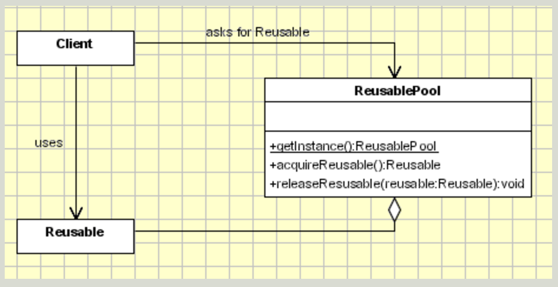

# Object pool (Creational)
>Improve performance by reusing objects which creation can be significantly expensive

## Problem
Object creation is expensive, the number of instances created is high and the number of instantiations
in use at any one time is low 

## Solution
Create a kind of cache to store instances created. Clients request to the pool an instance instead of 
create a new one by themselves.

The pool has the capacity of creating more instances if required but, if possible, will retrieve an
existent and unused instance.

## General diagram

## Actors
- **Reusable**. Wraps the limited resource, will be shared by several clients for a limited amount of time.
- **Client**. Uses an instance of type Reusable.
- **ReusablePool** Manage the reusable objects for use by Clients, creating and managing a pool of objects.

## Considerations
If resources are limited, object pool can have a max. limit of instances to be created.

## Related patterns
- Object pool is crated as a Singleton so it can know and manage every instance created.
- While the Prototype pattern helps in improving the performance by cloning the objects, the
  object pool pattern offers a mechanism to reuse objects that are expensive to create

## References

- http://www.oodesign.com/object-pool-pattern.html
- https://sourcemaking.com/design_patterns/object_pool 
 