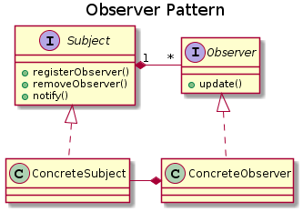
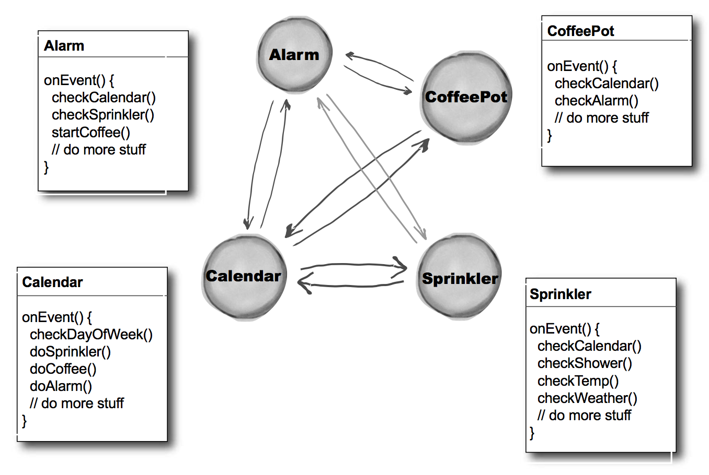
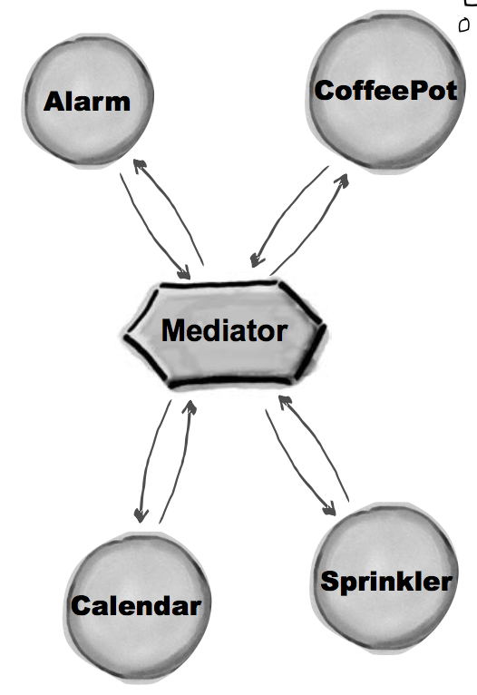

# Observer Pattern
 
Belongs to behavioral patterns

> Defines a one to many dependency between objects so that when one object changes state, all of 
its dependents are notified and updated automatically

---
## Problem

When certain objects need to be informed about the changes occurred in other object in other words
if an object needs to publish information and many objects will need to receive that information

---
## Solution

The Observer Design Pattern can be used when a subject has to be observed by one or more observers

---
## Characteristics

- The Observer pattern allows the subject and observer to form a publish-subscribe relationship
- Observers are dependent on subject
- Subject doesn't need to know how many observers it has. It simply broadcasts a change in its state
- Relation one to many

----
## Actors

- **Subject**: Interface for specify the registering/removing observers as well as the notifying (Optional)
- **ConcreteSubject**: Class which implements the specification defined by Subject, additionally can 
have setters and getters for the current state
- **Observer**: Interface for specifying the update for observers
- **ConcreteObserver**: Class which implements the specification defined by Observer, each 
ConcreteObserver is registered with a ConcreteSubject to receive updates

---
## Benefits

- Decouples the observers and the subject
- Extensible code, it's possible to add new observers at any time without modifying the subject

---
## Use

- JavaBeans
- Swing
- MVC pattern

---
## Observer vs Mediator Pattern

- Mediator centralize communication between objects. Relation many to many through 'mediator' class
  - Before mediator: 
  
  
  
  - Implementing mediator: 
  
  

- Observer works in a publish-subscribe way 

