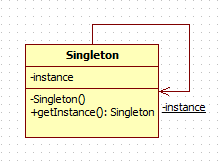

Singleton Pattern (Creational)

>  The Singleton Pattern ensures a class has only one instance, and provides a global point of 
access to it.

---
## Problem

There are many objects that we only need one of them, i.e.
- Thread pools
- Caches
- objects that handle preferences and registry settings, 

For many of these types of objects, if we were to instantiate more than one we’d run into all 
sorts of problems like incorrect program behavior, overuse of resources, or inconsistent results

---
## Solution

the Singleton Pattern ensures one and only one object is instantiated for a given class also 
gives us a global point of access

---
## Characteristics

- Ensures you have at most one instance of a class in your application
- Provides a global access point to that instance
- Implementation of the design.pattern.singleton.Singleton Pattern makes use of a private constructor, a static method 
combined with a static variable (At least on Java based languages)
- Be aware of multithreading
- design.pattern.singleton.Singleton is created in a lazy/eager manner

---
## Actors

- getInstance():  static method, so you can conveniently access this method from anywhere in your code using design.pattern.singleton.Singleton.getInstance(). 
- instance: The instance is a class variable which holds our one and only one instance of design.pattern.singleton.Singleton
- design.pattern.singleton.Singleton(): private constructor, so it's accessible only inside the class

---
## Applicability

Use Singleton pattern when:

- There must be exactly one instance of a class, and it must be accessible to clients from a well-known access point.

---
## Benefits

- Controlled access to sole instance
- The Singleton pattern is an improvement over global variables
