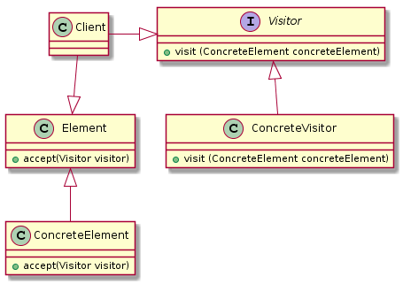

# Visitor Pattern (Behavioral)

> Represent an operation to be performed on elements of an object structure. 
Visitor lets you define a new operation without changing the classes of the elements on which it 
operates.

---
## Problem

Perform many **distinct and unrelated operations** over an structure of elements 

---
## Characteristics

- Visitor lets define a new operation without changing the classes of the elements on which operate
- It's a way of separating an operation from an object structure on which it operates
- Usually implemented trough Iterator pattern
- Visitors can accumulate state as they visit each element in the object structure

---
## Actors

- Visitor: 
  - Declares a **visit** operation for each class of **ConcreteElement** in the object structure
  - The operation's signature identifies the class that sends the **visit** request
- ConcreteVisitor:
  - Provides the context for the algorithm and stores its local state
  - Each operation implements the algorithm defined for the corresponding class of object in the structure
  - This state often accumulates results during the traversal of the structure
- Element:
  - Defines an **accept** operation that takes a visitor as an argument
- ConcreteElement:
  - Implementation which performs the **visit** operation from the **visitor** in the **action** method
  
---
## Applicability

If the Element class hierarchy is stable, but you are continually adding operations or changing 
algorithms, then the Visitor pattern will help you manage the changes

---
## Pros & Cons

#### Pros:
- Visitor makes adding new operations easy
- A visitor brings together related operations and separates unrelated ones
  
#### Cons:
- Adding new ConcreteElement classes is hard
- Breaking OO principles